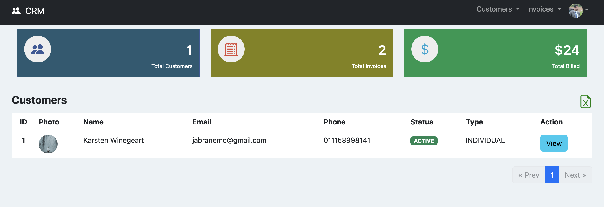
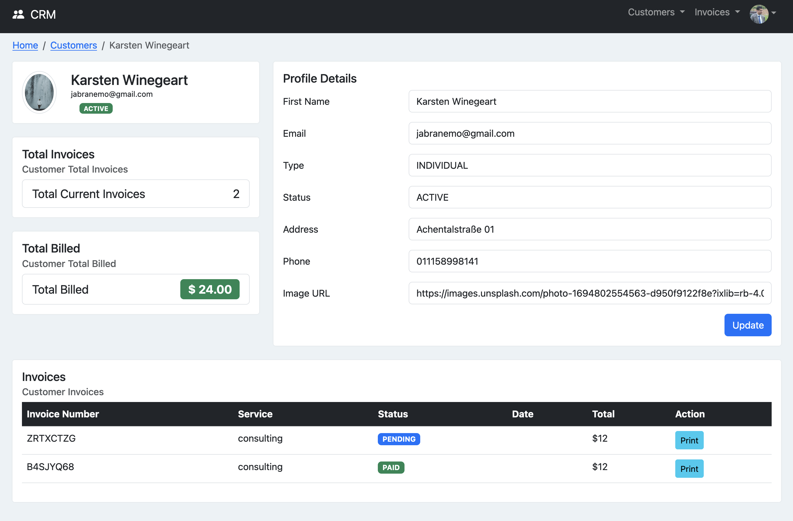
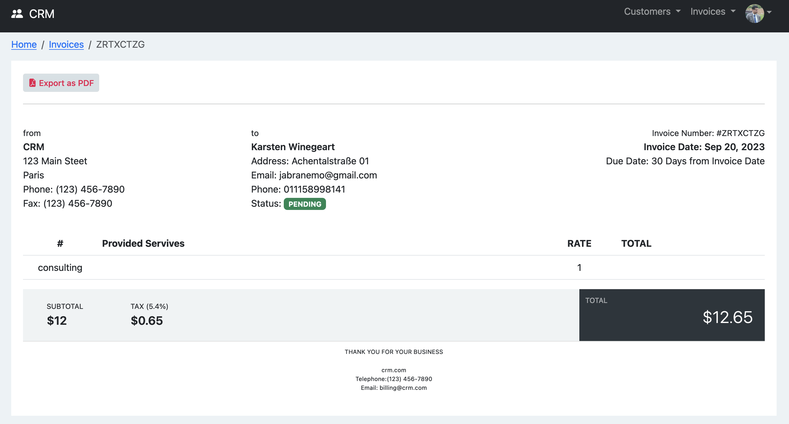

# CRM APP 

## Expectations
- Small app containing some nice feature which can be reused in real projects.

## Feature

### Front
- 1 . Authentification using JWT
- 2 . MFA avec Twilio
- 3 . Export html table to Excel
- 4 . Export invoice to PDF using (jspdf)
- 5 . Guard, Lazy Module ....

### Back
- 6 . Sending verification email using spring-boot-starter-mail and template 
- 7 . MFA communication with Twilio(com.twilio.sdk)
- 8 . YAUAA(https://yauaa.basjes.nl/)
- 9 . MYSQL classique

